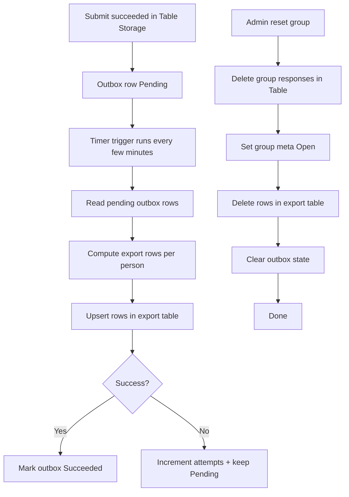

# Wedding RSVP Backend (Azure Functions .NET 8 + Azure Table Storage) — TODO

This document is the execution plan for building the backend for the wedding RSVP website.

## Goals

- Serverless backend on Azure Functions (C# .NET 8 LTS, isolated worker).
- Data storage in Azure Table Storage (cost-effective).
- Guests:
  - Arrive at the website:
    - Preferred: via QR code that includes a secret GUID query param (establishes an authenticated session).
    - If visiting without QR: only see a 6-digit code input; after entering a valid code they can continue.
  - Search by name.
  - Select their group (disambiguated by a label showing first names of the group).
  - One person can submit responses for the entire group.
  - Once submitted, the group becomes final (no further edits by guests).
  - If a group is already submitted, its members become disabled in the UI with status “Bevestigd”.
- Admin:
  - Can reset a group (which must also delete all previous answers for the group).
  - Reset re-enables the group for RSVP.
- RSVP deadline: “respond before 1 May 2026” (backend should expose this as a date + closed flag).
- Backend returns enums/structured fields; frontend handles localization.
- On submit, responses are also exported to a Google Sheet (see dedicated section below).

## Non-goals (explicitly out of scope)

- No open/public brute-force protection beyond the QR-secret gate.
- No Entra/EasyAuth.
- No Application Insights wiring (logging via `ILogger` is still fine).

## Key Product Decisions (already confirmed)

- Lookup: name-only (within the allowed guest list).
- Access: required session, established by either QR param or 6-digit code.
- Locking: group lock uses expiration (TTL) so it auto-unlocks if abandoned.
- Finality: after submit, group is immutable for guests; only admin reset can reopen.
- Allergies:
  - Only required for people who answer `Attending = Yes`.
  - For attending people: ask `HasAllergies` yes/no.
  - If `HasAllergies = Yes`, require allergy text.

### Events + attendance rules

- Events are only:
  - `Dinner`
  - `EveningParty`
- Invitation permissions are per-group.
- For each event the group is invited to:
  - The group must indicate attendance as:
    - `None` (not attending)
    - `All` (all members attending)
    - `One` (exactly one member attending)
- For groups invited to the evening party, they must also answer whether they will be there or not.
  - Implementation note: represent this as `None/All/One` as well; `None` covers “not there”.
  - If you prefer a separate yes/no + all/one, the backend should still normalize to `None/All/One`.
- If `Dinner = One` or `EveningParty = One`, the submission must include which person is the single attendee for that event.

Derived per-person attendance (keeps backend + export consistent and simple):
- Each person must still answer overall RSVP `Attending = Yes/No`.
- Event attendance is then derived from (a) group event mode and (b) per-person `Attending`:
  - If a person has `Attending = No` ⇒ they attend no events.
  - If group event mode is `All` ⇒ every person with `Attending = Yes` attends that event.
  - If group event mode is `One` ⇒ exactly one person with `Attending = Yes` is selected for that event; other attending people do not attend that event.
  - If group event mode is `None` ⇒ nobody attends that event.

Important scenario alignment:
- It is valid for one person in a group to say “YES” and attend only Dinner while another person in the same group attends both Dinner + Evening Party.
  - This is represented as: `DinnerAttendance = All` and `EveningPartyAttendance = One` with the “both” person selected as the party attendee.

---

## Flowcharts

### Guest flow (session → search → claim → submit)

```mermaid
flowchart TD
  A[Visitor lands on site] --> B{Has valid session cookie?}
  B -- Yes --> W[Welcome page]
  B -- No --> C{Has QR param k?}
  C -- Yes --> D[GET /api/session/from-qr?k=...] 
  D --> E{QR key valid?}
  E -- Yes --> F[Set HttpOnly session cookie]
  E -- No --> G[Show 6-digit code input]
  C -- No --> G[Show 6-digit code input]
  G --> H[POST /api/session/start {code}]
  H --> I{Code valid?}
  I -- Yes --> F[Set HttpOnly session cookie]
  I -- No --> G
  F --> W

  W --> J[Search by name]
  J --> K[GET /api/search?q=...]
  K --> L[Select group (label shows first names)]
  L --> M[POST /api/groups/{groupId}/claim]
  M --> N{Group confirmed?}
  N -- Yes --> O[UI shows disabled: Bevestigd]
  N -- No --> P{Lock acquired?}
  P -- No --> Q[Show locked message + retry]
  P -- Yes --> R[GET /api/groups/{groupId}?sessionId=...]
  R --> S[Fill per-person YES/NO + allergies]
  S --> T[Choose DinnerAttendance / EveningPartyAttendance]
  T --> U{Any event = One?}
  U -- Yes --> V[Select the single attendee for that event]
  U -- No --> X[Review]
  V --> X[Review]
  X --> Y[POST /api/groups/{groupId}/submit?sessionId=...]
  Y --> Z{Validation OK + lock OK?}
  Z -- No --> S
  Z -- Yes --> AA[Write Table Storage + mark Confirmed]
  AA --> AB[Mark export outbox Pending]
  AB --> AC[Return Confirmed]
```

### Background flow (export + admin reset)



---

## Scenarios (how the rules work)

### Scenario 1 — Group invited to Dinner + Evening Party, everyone attends both

- Inputs:
  - `DinnerAttendance = All`, `EveningPartyAttendance = All`
  - Each person: `Attending = Yes`
- Result:
  - Sheet: every person gets `X` under Dinner and Evening Party.

### Scenario 2 — Group invited to Dinner + Evening Party, exactly one person attends the party

- Inputs:
  - `DinnerAttendance = All`, `EveningPartyAttendance = One`
  - Person A: `Attending = Yes` (will attend both)
  - Person B: `Attending = Yes` (will attend dinner only)
  - `EveningPartySingleAttendeePersonId = PersonA`
- Result:
  - Sheet:
    - Person A: Dinner `X`, Evening Party `X`
    - Person B: Dinner `X`, Evening Party empty

### Scenario 3 — Dinner only, no party

- Inputs:
  - `DinnerAttendance = All`, `EveningPartyAttendance = None`
  - Some persons `Attending = Yes`, others `Attending = No`
- Result:
  - Only `Attending = Yes` people get Dinner `X`.
  - Nobody gets Evening Party `X`.

### Scenario 4 — Nobody attends anything

- Inputs:
  - `DinnerAttendance = None`, `EveningPartyAttendance = None`
  - All persons `Attending = No`
- Result:
  - Sheet has rows for each person, but Dinner/Party empty, Allergies empty.

---

## Edge cases (and expected behavior)

- Lock expired mid-edit:
  - Submit must fail with `409` and a clear error code (frontend prompts user to re-claim).
- Concurrent claim:
  - Second claimant gets `409` while lock active.
- Submit after confirmed:
  - `409` (final), only admin reset can reopen.
- Invalid “One” selection:
  - If event attendance is `One` but selected person has `Attending = No` ⇒ `400` validation error.
  - If `One` but no one in group has `Attending = Yes` ⇒ `400`.
- Allergies rules:
  - `Attending = No` but allergies filled ⇒ `400`.
  - `HasAllergies = Yes` but empty text ⇒ `400`.
- Duplicate names across groups:
  - Search returns multiple entries; UI disambiguates via `groupLabelFirstNames`.
- Export failure:
  - RSVP still stored in Table Storage; outbox retry eventually makes the export table consistent.

---

## Phase 0 — Repo hygiene & conventions

- [x] Add `README` section for backend with local run steps and env vars (keep it short).
- [x] Add `.gitignore` hardening if needed (ensure `local.settings.json` isn’t committed).
- [x] Confirm `host.json` setup (using NuGet-based extensions for isolated worker; no extension bundle required).
- [x] Decide folder layout inside `wedding-api/src/` (keep SOLID + testable):
  - `Domain/` (pure types + rules)
  - `Application/` (use cases/services)
  - `Infrastructure/` (Table Storage, JSON invite source)
  - `Functions/` (HTTP triggers only)

---

## Phase 1 — Domain model (SOLID + testable)

Create small, stable domain types with minimal coupling.

- [x] Define enums used by API:
  - `AttendingStatus`: `No | Yes`
  - `ConfirmationStatus`: `Open | Locked | Confirmed`
  - `EventType`: `Dinner | EveningParty`
  - `EventAttendance`: `None | All | One`
- [x] Define domain records:
  - `GroupDefinition`:
    - `GroupId` (string)
    - `GroupLabelFirstNames` (string) — used for disambiguation in UI
    - `InvitedToEvents` (list of `EventType`)
    - `Members` (list of `PersonDefinition`)
    - `AccessKeyId`? (optional future: per-group key; for now, global key)
  - `PersonDefinition`:
    - `PersonId` (string, stable)
    - `FullName` (string)
- [x] Define response records:
  - `PersonResponse`:
    - `Attending` (`AttendingStatus`)
    - `HasAllergies` (bool?)
    - `AllergiesText` (string?)
  - `GroupEventResponse`:
    - `DinnerAttendance` (`EventAttendance`)
    - `EveningPartyAttendance` (`EventAttendance`)
    - `DinnerSingleAttendeePersonId` (string?)
    - `EveningPartySingleAttendeePersonId` (string?)
- [x] Validation rules (pure functions, unit testable):
  - `Attending = No` ⇒ allergies fields must be empty
  - `Attending = Yes` ⇒ `HasAllergies` must be provided
  - `HasAllergies = Yes` ⇒ `AllergiesText` required, trimmed, max length (e.g. 200)
  - `HasAllergies = No` ⇒ `AllergiesText` must be empty
  - If group is not invited to an event, it must not be present in the submission
  - If `DinnerAttendance = One` ⇒ `DinnerSingleAttendeePersonId` required and must be a member with `Attending = Yes`
  - If `DinnerAttendance = All` ⇒ no single attendee id must be present
  - If `DinnerAttendance = None` ⇒ no single attendee id must be present
  - Same rules for `EveningPartyAttendance`
  - If `DinnerAttendance = One` ⇒ at least one person must have `Attending = Yes`
  - If `DinnerAttendance = All` ⇒ no extra constraints; people can still be `Attending = No`
  - If `EveningPartyAttendance = One` ⇒ same constraints as dinner

---

## Phase 2 — Invite source (JSON)

Your guest list + group permissions are defined by you in a JSON file.

- [ ] Decide where config lives:
- [ ] Decide where config lives (keep it simple):
  - Recommended: ship JSON as a content file in the Function zip (redeploy to update).
  - Only switch to blob URL if you expect frequent edits without redeploy.
- [x] Define JSON schema (versioned) and document it in backend README.
- [x] Implement `IInviteRepository`:
  - `SearchPeopleByName(query)`
  - `GetGroup(groupId)`
- [x] Implement `JsonInviteRepository`:
  - Parse once and cache in-memory with reload interval (e.g. 5 min) to reduce cost.
  - Ensure deterministic `PersonId` and `GroupId` (don’t rely on array order).
- [x] Unit tests for JSON parsing + schema validation.

---

## Phase 3 — Storage design (Azure Table Storage)

### Tables

- [x] `RsvpGroups` table:
  - `PartitionKey = groupId`
  - `RowKey = "meta"`
  - Fields:
    - `Status` (`Open | Locked | Confirmed`)
    - `LockSessionId` (string)
    - `LockExpiresAtUtc` (DateTimeOffset)
    - `ConfirmedAtUtc` (DateTimeOffset?)
    - `AccessedAtUtc` (DateTimeOffset?)
    - `DinnerAttendance` (`None|All|One`)
    - `EveningPartyAttendance` (`None|All|One`)
    - `DinnerSingleAttendeePersonId` (string?)
    - `EveningPartySingleAttendeePersonId` (string?)
    - `SchemaVersion` (int)

- [x] `RsvpResponses` table:
  - `PartitionKey = groupId`
  - `RowKey = personId`
  - Fields:
    - `FullName`
    - `Attending` (`Yes|No`)
    - `HasAllergies` (bool)
    - `AllergiesText` (string)
    - `UpdatedAtUtc`

Note: Dinner/Evening attendance is group-level but exported per-person; per-person event attendance can be derived:
- If group attendance is `All`, every person with `Attending = Yes` is marked `X` for that event.
- If `One`, only the single selected person is marked `X`.
- If `None`, no one is marked `X`.

Cost note: use Table transactions (`SubmitTransaction`) to upsert all group rows + meta in one go.

### Concurrency and invariants

- [x] Use ETags for optimistic concurrency:
  - Claim lock: update `RsvpGroups/meta` with `If-Match`.
  - Submit: must transition `Locked -> Confirmed` with the same `LockSessionId`.
- [ ] Enforce invariants:
  - Can’t claim if `Status = Confirmed`.
  - Can’t submit unless `Status = Locked` and lock not expired.
  - TTL expiry should be checked on every read/claim.
- [x] Reset group:
  - Delete all `RsvpResponses` rows for that group.
  - Reset `RsvpGroups/meta` back to `Open`.

---

## Phase 4 — Application services (use cases)

Implement clean services with interfaces so Functions stay thin.

- [ ] `IAccessGate`:
  - Supports establishing an authenticated session either via:
    - QR secret GUID query param (e.g. `k=...`)
    - 6-digit access code (user enters it when not arriving via QR)
  - Returns `Forbidden` if no valid session.
  - Implementation (keep it simple + cheap): issue an HttpOnly session cookie after successful QR/code exchange.
    - Cookie contains a signed, short-lived token (HMAC) so we don’t need server-side session storage.
  - Settings:
    - `RSVP_QR_ACCESS_KEY` (GUID string)
    - `RSVP_6DIGIT_ACCESS_CODE` (string, exactly 6 digits)
    - `RSVP_SESSION_TTL_MINUTES` (e.g. 120)
    - `RSVP_SESSION_SIGNING_KEY` (random secret string for HMAC)

- [ ] `IRsvpSearchService`:
  - Input: `nameQuery`
  - Output: matching people + their group label + group status.
  - Must join invite JSON with `RsvpGroups` status (Open/Locked/Confirmed).

- [ ] `IRsvpGroupService`:
  - `ClaimGroup(groupId)` → returns `sessionId`, `lockExpiresAtUtc`
  - `GetGroupForEditing(groupId, sessionId)` → returns group definition + existing answers (if any)
  - `SubmitGroup(groupId, sessionId, groupEventResponse, personResponses)` → persists and marks confirmed

- [ ] `IAdminRsvpService`:
  - `ResetGroup(groupId)` → deletes responses + opens group
  - Admin access should be gated by a separate secret (e.g. `adminKey=...`) OR reuse QR key if you truly want one key.
    - Decide: separate `RSVP_ADMIN_KEY` is safer and still trivial.

---

## Phase 5 — HTTP API (Functions)

### Route contract (minimal and stable)

- [x] `POST /api/session/start`
  - Purpose: establish session when visiting without QR.
  - Body: `{ code: "123456" }`
  - Result:
    - Option A: sets HttpOnly cookie
    - Option B: returns `{ sessionToken, expiresAtUtc }`

- [x] `GET /api/session/from-qr?k=...`
  - Purpose: establish session from QR param (first visit).
  - Result: same as `/api/session/start`.

- [x] `GET /api/config`
  - Returns:
    - `deadlineUtc` (or date-only)
    - `isClosed` (server-computed)

- [x] `GET /api/search?q=...`
  - Returns a list of:
    - `personId`, `fullName`
    - `groupId`, `groupLabelFirstNames`
    - `groupStatus` enum

- [x] `POST /api/groups/{groupId}/claim`
  - Returns `sessionId`, `lockExpiresAtUtc`, `groupStatus`

- [x] `GET /api/groups/{groupId}?sessionId=...`
  - Returns group:
    - `groupId`, `groupLabelFirstNames`, `invitedToEvents` (enum list)
    - `members[]` with existing response state
    - `eventAttendance` (group-level) for dinner/evening (if invited)
    - `groupStatus`

- [x] `POST /api/groups/{groupId}/submit?sessionId=...`
  - Body: group-level event attendance + responses for each personId in the group.
  - Server validates:
    - All persons in group are present in payload
    - Domain validation rules for allergies
    - Event attendance rules (`None/All/One` + single attendee constraints)
  - Result: `Confirmed`.

- [x] `POST /api/admin/groups/{groupId}/reset?adminKey=...`
  - Resets and deletes responses.

Note: all non-session endpoints require the session cookie.

### HTTP behavior requirements

- [ ] CORS: allow the Angular frontend origin(s) (local + prod).
- [x] Return consistent error shapes:
  - `400` validation error (list of fields)
  - `401/403` access gate errors
  - `409` conflict (already confirmed, lock held by someone else, ETag conflict)
- [x] Ensure no PII is logged (names and allergy text should not be logged).

---

## Phase 6 — Infrastructure wiring

- [x] Add NuGet dependencies:
  - `Azure.Data.Tables`
  - `Microsoft.Extensions.Options.ConfigurationExtensions` (if needed)
  - Test packages: `xunit`, `FluentAssertions` (optional), `Microsoft.NET.Test.Sdk`
- [x] Configure DI in `Program.cs`:
  - Register `IInviteRepository`, Table clients, services.
  - Register options (`RsvpOptions`) for:
    - `RsvpQrAccessKey` (GUID)
    - `Rsvp6DigitAccessCode` (string)
    - `RsvpSessionTtlMinutes` (int)
    - `RsvpSessionSigningKey` (string)
    - `AdminKey` (GUID)
    - `DeadlineDate` (2026-05-01)
    - `LockMinutes` (e.g. 15)
    - `AllergiesTextMaxLength` (e.g. 200)

---

## Phase 6.5 — Export table (on submit)

All confirmed responses must be written to Azure Table Storage in this exact table format:

| Full name | Dinner | Evening Party | Allergies |

Rules:
- Dinner and Evening Party cells use an `"X"` when that person will attend that event; otherwise empty.
- Allergies cell must be exactly the text input when allergies were indicated; otherwise empty.

Row mapping rules (important for correctness):
- For each person in the group, create/update exactly one row.
- Dinner cell:
  - `X` if `DinnerAttendance = All` and `Attending = Yes`
  - `X` if `DinnerAttendance = One` and `personId == DinnerSingleAttendeePersonId`
  - otherwise empty
- Evening Party cell:
  - same logic as Dinner (using EveningParty fields)
- Allergies cell:
  - exact `AllergiesText` when `HasAllergies = Yes` (and `Attending = Yes`)
  - otherwise empty

Implementation notes:
- Store rows in an export table (default: `RsvpExportRows`) with:
  - `PartitionKey = groupId`
  - `RowKey = personId`
- Upsert replaces the row for a given `(groupId, personId)`.
- On reset, delete all rows in that group partition.

Configuration:
- `ExportTable__TableName`

Reliability:
- Keep a minimal export outbox table (`RsvpSheetExports`) for retries.
- If Table Storage commit succeeds but export write fails, retry until consistent.

---

## Phase 7 — Testing (valuable, runnable)

### Unit tests (fast)

- [x] Domain validation:
  - Attending/no attending allergy rules
  - Allergy text trimming + max length enforcement
  - Event attendance validation (`None/All/One` + single attendee)
  - Derived attendance rules (event X mapping uses group mode + per-person attending)
- [x] JSON invite parsing:
  - Valid schema
  - Missing fields → fails
  - Duplicate person names across groups → allowed, still searchable

### Integration tests (Table Storage)

- [x] Use Azurite locally for Storage.
- [x] Test lock acquisition:
  - claim success
  - claim conflict while locked
  - auto-unlock after TTL
- [x] Test submit flow:
  - must be locked
  - after submit, status is Confirmed and responses exist
  - further submit attempts fail with 409
  - event attendance persisted on group meta
- [x] Test reset:
  - responses deleted
  - group re-opened

Implementation status:
- [x] Added Azurite-backed integration tests (auto-skip unless `AzureWebJobsStorage` is set)
- [x] Fixed lock claim so a second claimant does not receive a usable `sessionId`

### API-level tests

- [ ] Basic happy-path tests for each endpoint using `HttpClient` against Functions host (or minimal host abstraction).
- [x] Access key required tests.
  - session establishment by QR and by 6-digit code

### Export tests

- [x] Unit test the “row mapping” logic (from group + per-person responses to `| Full name | Dinner | Evening Party | Allergies |`).
- [ ] Integration test exporter behind an interface.

---

## Phase 8 — Local development experience

- [x] Document local run:
  - `func start` or VS Code debug
  - Azurite setup (ports, connection string)
  - required settings in `local.settings.json`:
    - `AzureWebJobsStorage`
    - `RSVP_QR_ACCESS_KEY`
    - `RSVP_6DIGIT_ACCESS_CODE`
    - `RSVP_SESSION_TTL_MINUTES`
    - `RSVP_SESSION_SIGNING_KEY`
    - `RSVP_ADMIN_KEY`
    - `RSVP_DEADLINE` (e.g. `2026-05-01`)
    - `INVITES_JSON_PATH` or equivalent

---

## Phase 9 — Deployment checklist (later)

- [ ] Pick plan: Flex Consumption (FC1) when deploying.
- [ ] Set app settings + storage connection.
- [ ] Configure CORS for production web origin.
- [ ] Ensure secrets not in code and not logged.

---

## Open questions (should be decided before implementation)

- [ ] Single secret (`RSVP_ACCESS_KEY`) for guests and admin reset, or separate `RSVP_ADMIN_KEY`?
- [ ] Where do you want the invite JSON to live in production (packaged file vs blob URL vs app setting string)?
- [ ] Should search return only “people not confirmed yet”, or always return matches but marked disabled when confirmed?
- [ ] Do you want the admin reset to require a separate admin session (recommended) or only `adminKey` query param?
